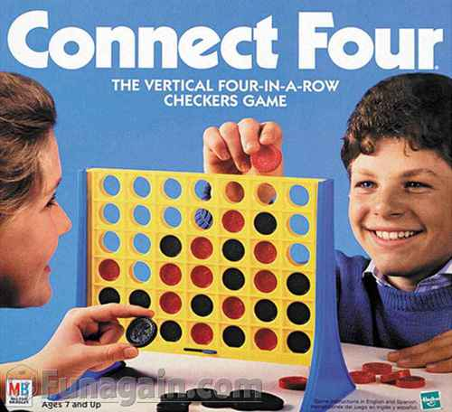
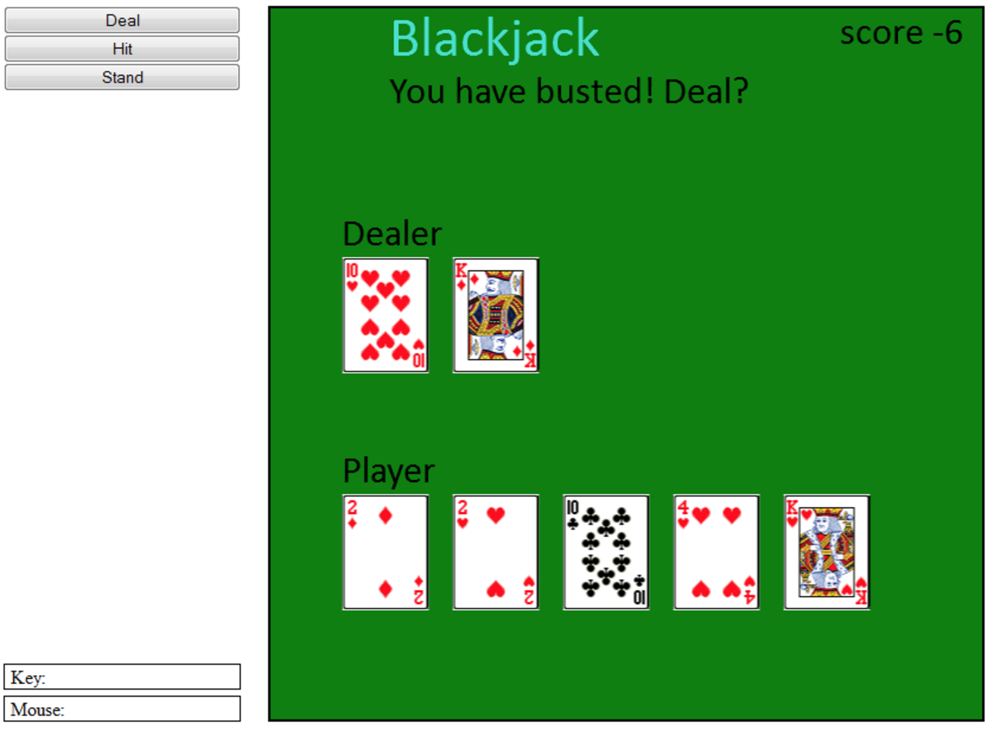
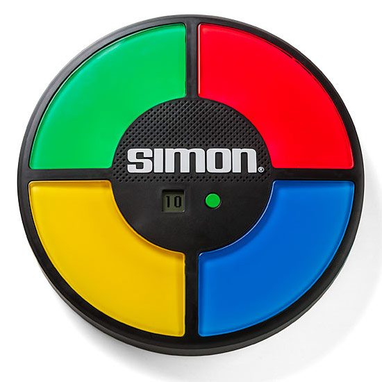

#  Project #1: Let the Games Begin

## PROJECT Requirements

For your first project you will build a simple game as a Web Application. You must choose from one of the games listed below!

### Project Objectives

The objectives of this project are to:

* Demonstrate your ability to use `HTML` and `CSS` to build and style an intuitive web application
* Demonstrate your competancy in _DOM manipulation_ using JavaScript
* Publish your source code to _GitHub_ with a solid `README.md` describing the project
* Deploy your application to a production environment such [BitBalloon](https://www.bitballoon.com/)
* Present your project in a presentation style format

#  Project #1: The Game
​

## Project Ideas

### Jeopardy

Write a _Jeopardy_ game that allows the user to play the game of _Jeopardy_. This is a quiz game where the user gets to choose the next question by choosing from a category and then choosing a point amount (100 to 500). The questions are phrased as answers and the user chooses from a list of 4 questions that match the answer. For instance:

The User sees this: `A programming construct for easily looping through the elements in an array`
The User chooses this: `What is a for loop`

#### Bonus Ideas:

* Have a "Round 1" and a "Round 2" where the questions in Round 2 are more difficult but also score higher points.
* Have different themes for the questions, such as:
  - Web Development Topics
  - Arts and Entertainment
  - Science and Science Fiction

---

### Hangman

Write a _Hangman_ game that displays a secret word as a list of hidden letters. Also display an alphabet of letters that the user can guess while trying to guess the word. After a letter is used, disable that letter from the alphabet so the user will not try to guess the same letter twice. When a guess matches one or more letters in the secret word, reveal those letters to the user. Keep track of the number of incorrect guesses and end the game if the number of incorrect guesses reaches 6. If the user reveals all of the hidden letters before reaching 6 incorrect guesses, then the user wins.

#### Bonus Ideas:

* Display a _hangman_ as either ASCII art or images that represent the various stages of the _hangman_.
* Display a scoreboard of how games won and lost.
* Choose a theme for the game, such as "Famous Movies" or "Web Development Terms"

---

### Connect 4

Write a _Connect 4_ game that allows two players to compete. The players are sharing the same computer but the game detects when a player has won the game. A scoreboard keeps track of how many times Player 1 has won and how many times Player 2 has won.

#### Bonus Ideas:

* Alternate the first player to move: Player 1 moves first in game 1, Player 2 moves first in game 2, etc.
* Allow players to enter their name and display their name instead of "Player 1" and "Player 2".
* Provide a way to play against the computer (using a simple A.I. algorithm)

---

### BlackJack

Write a _BlackJack_ game to try to beat the dealer. Allow the user to "Hit" or "Stand" based on their current score. Follow the common rules for _BlackJack_.

#### Bonus Ideas:
* Allow the user to place a bet (using chips, points, or dollars). Allocate a starting amount of chips and keep track of the user's chip count. If the user beats the dealer without busting, the user doubles their bet in chips. Otherwise the user loses their bet. 
* Allow the user to choose from different decks of cards (e.g. different styles)

## Bonuses for Any Game

* Keep score
* Make it responsive
* Add A.I. (player vs. computer)
* Add a timer
* Add music while a player makes a choice
* Create a theme via background images, sounds, music, avatars, etc.
  - Star Wars
  - Favorite Sports Team or Rivalry
  - Comic Book Characters
* Add avatar choices for the player
* Implement multiple games on your site

---

### Up for a real challenge? Simon

**You will need to figure out "asynchronous programming" in order to make this work**

Write a _Simon_ game that displays 4 colored buttons (or clickable areas) that light up and play a sound. Have the computer play a random sequence, starting with a length of 1 and growing with each round. If the user can replay the sequence by clicking on the colored buttons in the correct order, then the computer goes to the next round and the sequence gets longer (same sequence but with one new randomly generated selection added to the end). If the user is unable to replay the sequence, then their score is the length of the sequence they successfully replayed.

Have a unique sound for each colored button and play the sound both when the computer plays the sequence and when the user clicks on the buttons to replay the sequence. Have a special sound for when the user makes a mistake.

#### Bonuses:

* Display a scoreboard of the longest sequence successfully played to date.
* Have a way for the user to choose the difficulty (`easy`, `medium`, or `hard`) where the `easy` mode plays the sequence slowly (one second per highlighted button) and the `hard` mode plays the sequence more quickly (1/4 second per highlight).

## How to Get Started

* First design your _MVP_ (Minimum Viable Product). Have a plan for completing an MVP before getting too involved with _advanced_ features.
* Use _Trello_ to prioritize your User Stories / features. Focus on what is most important / critical to success.
* _Timebox_ any experimental or optional ideas, features, or technologies. Remember that good _time management_ is key!
* Commit your code early and often with good commit messages.
* Use Git Branching for experimenting with different ideas and technologies.

## Attendance, expectations of time commitment

Students are required to be in class working on their project during regular class hours. You are encouraged to continue working on your projects into the evenings on- and off-campus.

## Standups
We encourage you to hold your stand-ups in the mornings when you start working to help you all keep each other accountable and help each other out. When you start working each day, reach out on Slack and see if anyone is around to hold a standup!

If you have ideas on how you can help a fellow-student with work that they are stuck on, please follow-up with information AFTER the stand up.

## Where to go for help during project week

1. Seek out help online (read the Google Wiki for advice)
2. Seek out help with your buddy
3. Seek out help with your classmates
4. Submit GitHub issues to the repo and paste links in the debugging channel on Slack to ask for advice
5. Ask questions and communicate with your classmates over the debugging channel on Slack
6. Post to Stack Overflow, be sure to follow the format for submitting bug reports, provide lots of context!
7. Javascript and Jquery [videos](https://www.youtube.com/playlist?list=PLw1xVKFboueks5UMLogE01mdThRU577oa) produced by GA! 

## How to ask for help

*COMMIT/PUSH OFTEN! Your code on GitHub should be up to date. Submitting an issue and linking your classmates to old, out-of-date code will hinder the process.*

1. **WHAT YOU ARE TRYING TO SOLVE:**
  - Be able to give a detailed explanation of the feature or user story you're working on. 

2. **DETAILED DESCRIPTION OF THE BUG/ERROR:**
  - A detailed description of the problem, the bug, and/or the error. This means: the full steps to reproduce, a link to the file on github, and the line number of where the relevant code is.
The error(s) returned, copy and pasted/typed out/screenshot, not paraphrased.
  - If there is other code in a different file that is also essential to the functioning of the code that currently works point us to that and explain the relationship.

3. **WHAT I'VE TRIED**
  - List everything you've done to solve the bug on your own in detail. Show all resources you've looked up and tried to implement and provide links.

4. **QUESTION**
  - After going through all of these steps, what is your question? ("It's not working!" isn't a question.)

## Project Feedback + Evaluation

Your project will be evaluated by your instructional team in order to provide you with useful feedback. The following criteria will be used for the evaluation:

* __Project Workflow__: Did you complete the user stories, wireframes, task tracking, README, and/or ERDs, as specified above? Did you use source control as expected (30+ commits) for the phase of the program you’re in (detailed above)?

* __Technical Requirements__: Did you deliver a project that met all the technical requirements? Given what the class has covered so far, did you build something that was reasonably complex?

* __Creativity__: Did you add a personal spin or creative element into your project submission? Did you deliver something of value to the end user?

* __Code Quality__: Did you follow code style guidance and best practices covered in class, such as spacing, modularity, and semantic naming? Did you comment your code as your instructors have in class?

* __Deployment__: Did you deploy your application to a public url using BitBalloon or something equivalent?

## Useful Resources
​
* **[MDN Javascript Docs](https://developer.mozilla.org/en-US/docs/Web/JavaScript)** _(a great reference for all things Vanilla Javascript)_
* **[jQuery Docs](http://api.jquery.com)** _(if you're using jQuery)_
* **[GitHub Pages](https://pages.github.com)** _(for hosting your game)_